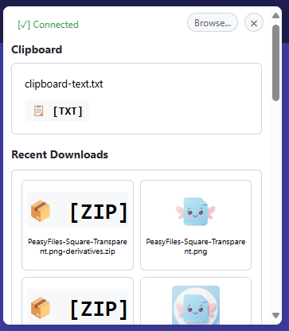

<div align="center">
  
  <h1>PeasyFiles</h1>
  <p>A seamless bridge between your clipboard, downloads, and file inputs!</p>
</div>

## 🚀 Features

- 📎 Instantly access clipboard contents for file uploads
- 📥 Browse recent downloads without leaving the current page
- 🖼️ Preview images and file types before uploading
- 🔒 Respects file type restrictions set by websites
- 💨 Lightning-fast file selection interface
- 🖥️ Desktop companion app for system integration

<div align="center">
  
</div>

## 🛠️ Installation

1. **Desktop App**
   - Download the latest release from [GitHub Releases](https://github.com/denizariyan/PeasyFiles/releases)
   - Run the installer and follow the setup instructions
   - The app will start automatically and run in the system tray

2. **Chrome Extension**
   - Install from the [Releases Page](https://github.com/DenizYunus/PeasyFiles/releases/download/Release/PeasyFilesChromeExtension.crx)
   - Or load unpacked from the `PeasyFilesChromeExtension` folder for development

## 🎯 How It Works

### Upload Files from Clipboard
Just copy any file and click a file input - it's that simple!
<div align="center">
  
</div>

### Quick Access to Recent Downloads
Browse and upload your recent downloads directly from any file input
<div align="center">
  
</div>

1. Click any file input on a webpage
2. PeasyFiles popup appears with your options:
   - Recently copied files from clipboard
   - Recent downloads from your browser
   - Browse button for traditional file selection
3. Click on your desired file to instantly upload it
4. That's it! No more hunting through folders

## 💻 Development

### Prerequisites
- Visual Studio 2002 (for Desktop App)
- Notepad (for Chrome Extension)
- Chrome (or any .crx supporting) Browser

### Setup
```bash
# Clone the repository
git clone https://github.com/DenizYunus/PeasyFiles.git

# Desktop App
Open PeasyFiles.sln in Visual Studio

# Chrome Extension
cd PeasyFilesChromeExtension
# Load unpacked extension in Chrome
```

## 🤝 Contributing

Contributions are welcome! Please feel free to submit a Pull Request. For major changes, please open an issue first to discuss what you would like to change.

## 📜 License

This project is licensed under the MIT License - see the [LICENSE](LICENSE) file for details.

## ⭐ Support

If you find this project helpful, please consider:
- Giving it a star on GitHub 🌟
- [Buying me a coffee ☕](https://buymeacoffee.com/denizyunus)
- Sharing it with others who might find it useful

## 🔗 Links

- [Project Homepage](https://github.com/DenizYunus/PeasyFiles)
- [Issue Tracker](https://github.com/DenizYunus/PeasyFiles/issues)
- [Chrome Web Store (Won't Give 5$ Install From Here lol)](https://github.com/DenizYunus/PeasyFiles/releases/download/Release/PeasyFilesChromeExtension.crx)

---

<div align="center">
  Made with ❤️ by <a href="https://github.com/DenizYunus">Deniz Yunus Göğüş</a>
</div>
